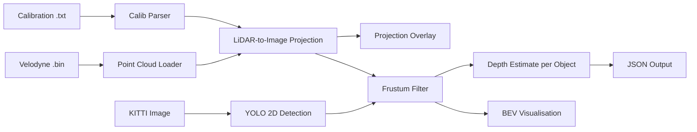

# Week 2 -- Camera-LiDAR Fusion on KITTI

## Objective

Camera-LiDAR fusion is a core technique in autonomous driving perception.
Cameras provide rich texture and colour for 2D detection, while LiDAR provides
accurate 3D geometry. Combining both modalities enables depth-aware object
detection without training a full 3D network.

This week builds a classical, explainable fusion pipeline using KITTI 3D Object
Detection data.

## Method

### Data Sources

| Source | Format | Content |
|--------|--------|---------|
| Camera | PNG (1242x375) | Left colour camera image |
| LiDAR | Binary float32 (Nx4) | Velodyne point cloud: x, y, z, intensity |
| Calibration | Text (key: values) | P2, R0_rect, Tr_velo_to_cam matrices |

### Coordinate Transforms

1. **Velodyne to Camera 0**: `pts_cam0 = Tr_velo_to_cam @ [x, y, z, 1]^T`
2. **Rectification**: `pts_rect = R0_rect @ pts_cam0`
3. **Camera to Image**: `[u, v, 1]^T = P2 @ [x, y, z, 1]^T / z`

Points with z <= 0 (behind the camera) are discarded.

### Frustum Filtering

1. Run YOLOv8 on the camera image to get 2D bounding boxes
2. Project all LiDAR points onto the image plane
3. For each 2D box, select LiDAR points whose projection falls inside
4. Compute depth statistics (median, mean) from the filtered points
5. Estimate an approximate 3D centre as the mean of filtered 3D coordinates

## Pipeline

## Results

| Output | Description |
|--------|-------------|
| `*_projection.png` | Camera image with LiDAR points coloured by depth |
| `*_boxes_lidar.png` | Camera image with YOLO boxes and filtered LiDAR |
| `*_bev.png` | Bird's-eye view with frustum-filtered points highlighted |
| `*_detections.json` | Per-object depth, 3D centre, and point count |

## Limitations

- 2D bounding boxes do not guarantee all enclosed LiDAR points belong to the object
- Occlusion can contaminate frustum-filtered points with background geometry
- Sparse LiDAR returns affect depth estimates for small objects (pedestrians, cyclists)
- This is frustum-based depth estimation, not full 3D object detection
- No orientation or 3D bounding box dimensions are estimated

## Next Steps

- Compare estimated depth with KITTI 3D ground truth labels
- Add 3D IoU evaluation against KITTI annotations
- Benchmark PointPillars or VoxelNet for learned 3D detection
- Connect 3D detections to the Week 1 tracking pipeline
- Explore BEVFusion-style deep fusion architectures
